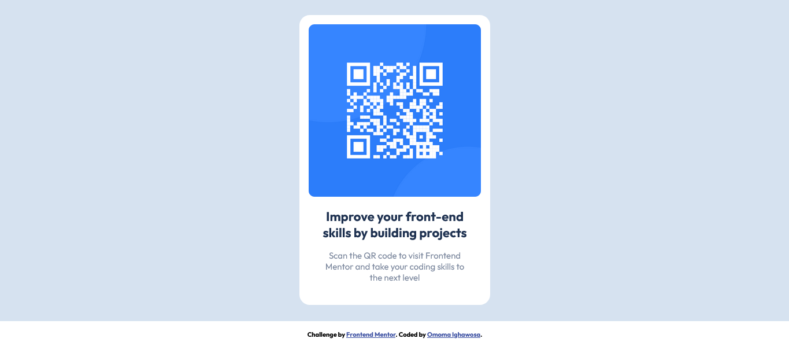

# Frontend Mentor - QR code component solution

This is a solution to the [QR code component challenge on Frontend Mentor](https://www.frontendmentor.io/challenges/qr-code-component-iux_sIO_H). Frontend Mentor challenges help you improve your coding skills by building realistic projects. 

## Table of contents

- [Overview](#overview)
  - [Screenshot](#screenshot)
  - [Links](#links)
- [My process](#my-process)
  - [Built with](#built-with)
  - [What I learned](#what-i-learned)
  - [Continued development](#continued-development)
- [Author](#author)


## Overview
I'm excited to take on my first challenge from Frontend Mentors, where I encountered a captivating QR code component design. It piqued my interest due to its unique visual elements and functionality. Using HTML and CSS, I meticulously crafted the design, paying attention to every detail and ensuring an engaging user experience.

### Screenshot



### Links

- Solution URL: [Github Repository Link](https://github.com/Ig-Matrix/Frontend-Mentor---QR-code-component-solution.)
- Live Site URL: [Link to live site](https://ig-matrix.github.io/Frontend-Mentor---QR-code-component-solution./)

## My process
To kickstart the development process, I began by creating the HTML markup for the QR code component. To keep things organized, I wrapped all the contents within a container div, providing a designated space for the component to reside.

Moving on to the stylesheet, I took a systematic approach to styling the component. I focused on one component at a time, ensuring its visual appearance and functionality before moving on to the next. By tackling each component individually, I could pay close attention to the intricate details and make necessary adjustments.

During the styling phase, I opted not to include media queries as the design remained consistent and visually appealing across different screen sizes. This decision was made based on the careful consideration that the component's layout and elements did not require specific adjustments to accommodate various devices. As a result, users could enjoy a seamless experience regardless of the screen they were using.

Throughout the process, I maintained a keen eye for aesthetics and user experience, striving to create a visually pleasing and intuitive QR code component. By following this systematic and meticulous approach, I ensured that every aspect of the design was thoughtfully implemented.

### Built with

- Semantic HTML5 markup
- CSS custom properties
- Flexbox
- CSS Grid

### What I learned
During this project, I gained valuable insights and acquired new skills that significantly contributed to my growth as a frontend developer. One noteworthy accomplishment was mastering the art of creating responsive images while preserving their aspect ratio.

To achieve this, I implemented a CSS code snippet that proved to be highly effective. By setting the height of the container element to "fit-content," I allowed it to dynamically adjust its height based on the dimensions of the image it contained. This ensured that the image maintained its original aspect ratio regardless of the screen size or device used.

Additionally, I applied specific styling to the image itself. Setting the width to 100% ensured that the image spanned the entire width of its container, adapting to different screen sizes seamlessly. The "object-fit" property was set to "contain," which allowed the image to scale while preserving its aspect ratio. This prevented any distortion or stretching of the image, providing a visually appealing and harmonious display.

Furthermore, I added a touch of visual appeal by applying a border-radius of 10 pixels to the image. This rounded the corners, giving the image a more polished and modern look.

By implementing this code snippet and understanding its underlying concepts, I not only achieved a responsive design for the image but also enhanced the overall visual quality of the QR code component. This newfound knowledge and skill will undoubtedly be beneficial in future projects, allowing me to create visually pleasing and user-friendly interfaces across various devices. 

See the code snippet below

```css
.img {
    height: fit-content;
}

img {
    width: 100%;
    object-fit: contain;
    border-radius: 10px;
}
```

### Continued development
In future projects, my focus for continued development will be:

Accessibility: Enhancing my understanding and implementation of accessibility best practices.
JavaScript and Interactivity: Expanding my JavaScript knowledge for creating dynamic user experiences.
Performance Optimization: Exploring techniques to improve website speed and performance.
Responsive and Mobile-First Design: Refining my skills in designing for mobile devices and responsive layouts.
Version Control and Collaboration: Strengthening my proficiency in using Git and collaborating with other developers.
These areas will drive my growth as a frontend developer, ensuring that I stay updated with industry standards and deliver high-quality solutions.

## Author

- Website - [Omoma Ighawosa](https://ig-matrix.github.io/Lesson_3_Task_6_Omoma_Ighawosa/)
- Frontend Mentor - [@Ig-Matrix](https://www.frontendmentor.io/profile/Ig-Matrix)
- Twitter - [@I_am_ig_matrix](https://twitter.com/i_am_Ig_matrix)